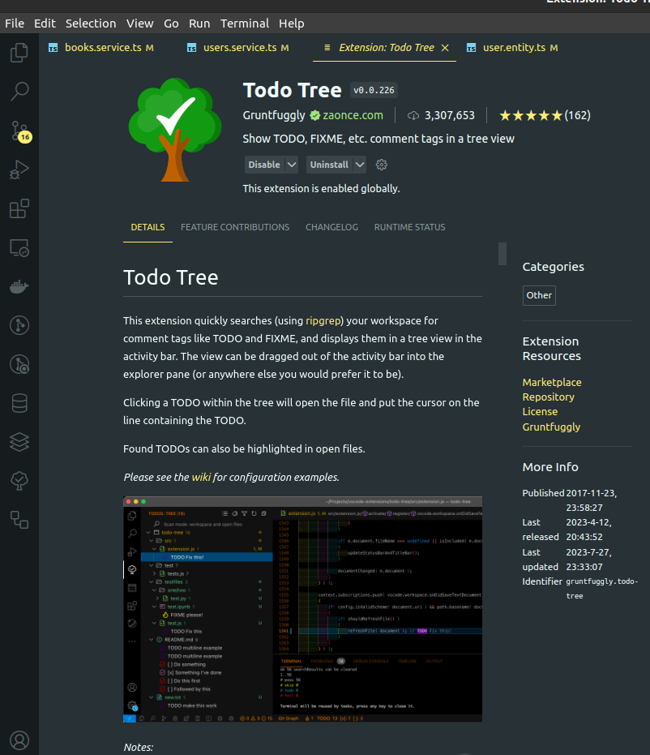
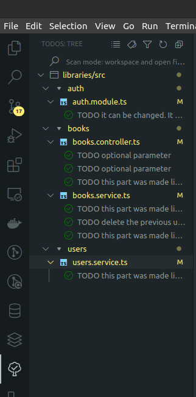

# Libraries

## Installation

```bash
$ pnpm install

```

## Comments section
To make it easier to find comments, you can install this plugin (if you use VSC) to find them faster.

When installed, on the left side you will see a tree icon and there
You will be able to see all the comments that were made, and if you click on any of them, it will take you to the comment itself.





## Env file
Create a .env file and copy the content of .evn.example into it

## Create admin user through sql file

```bash
$ pnpm run generate_admin

```

## Running the app

```bash
# watch mode
$ pnpm run start:dev

```
## Swagger documentation

- First, you have to log in with the user you created using the command and then, go to http://localhost:8000/docs

## Test

```bash
# test coverage
$ pnpm run test:cov

```

## Format code
If you want to donwload the project, and it does not look good, try running this command:

```bash
# formatter
$ pnpm run format

```
